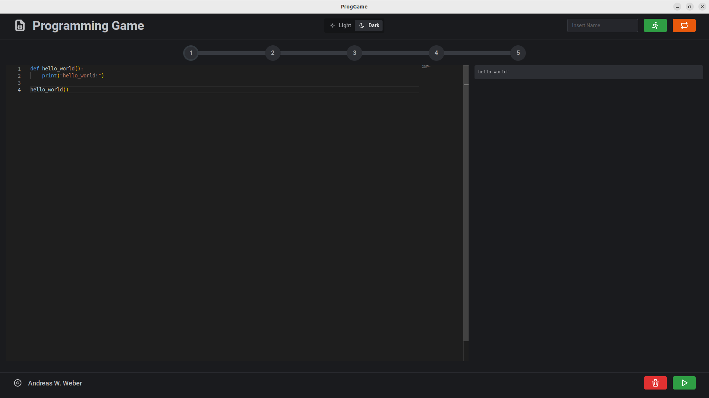

[](https://github.com/AndreasWillibaldWeber/ProgGame/actions/workflows/main.yml)

# Programming Game
A small game that allows to set and practice programming tasks.



## Manuals
* [User Manual](manuals/User_Manual-Programming_Game.pdf)

## Build Tools:
* neutralino.js
* React.js
* Mantine
* Monaco-Editor/React
* Tabler-Icons-React

## Prerequisites

* **Usage:**
  * python (3.x)
  * Linux user still needs to grant execution rights by using the command ```chmod +x filename``` before launching the application.
* **Development:**
  * python (3.x)
  * node.js (v18.16.1)
  * npm (v9.8.1)
  * Run all builds at least once.

## How to setup

```bash
sudo npm install -g @neutralinojs/neu
neu create ProgApp --template AndreasWillibaldWeber/ProgGame
```

## How to develop
```bash
cd react-src
npm i          # one-time execution of npm i is sufficient
npm start
cd ..
neu run --frontend-lib-dev
```

## How to debug
```bash
cd react-src
npm i          # one-time execution of npm i is sufficient
npm run build
cd ..
neu run -- --window-enable-inspector
```

## How to build
```bash
cd react-src
npm i          # one-time execution of npm i is sufficient
npm run build
cd ..
neu build --release
```

## Roadmap to v1.0.0
* [X] Create a GitHub actions workflow for automatic builds.
* [X] Create UI for programming and for program output.
* [X] Connect UI with Python interpreter.
  * [X] Program execution button works.
  * [X] Editor and output clear button works.
* [ ] Implement Game Logic.
  * [X] The player is given 5 randomly selected programming tasks one after the other, which must be solved in a single attempt.
  * [ ] Create 5 tasks as examples
  * [X] Button to start a game round works.
  * [X] Button to reset a game works.
  * [X] Input field for player name works.
  * [ ] Load tasks into the editor and check for correctness after execution.
  * [ ] Tasks, tests and template code can be defined by files.
* [ ] A List of player names that have completely solved a round can be displayed

## License

[MIT](LICENSE)
